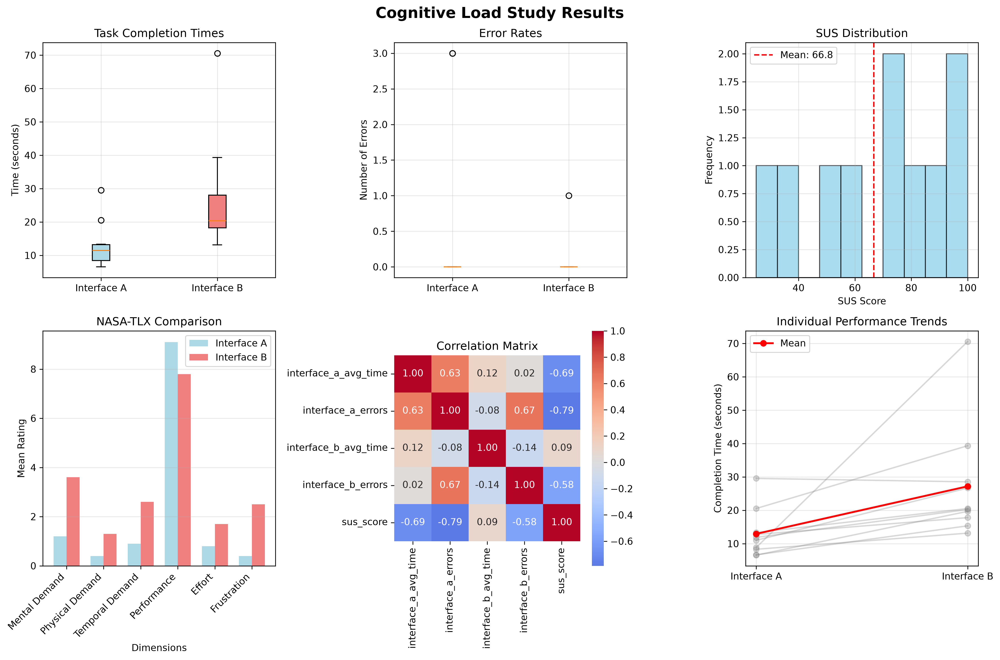

# 🧠 Cognitive Load & Usability Evaluation Study

> A full-stack human-factors study comparing interface complexity and cognitive load, complete with data collection, server-side storage, and comprehensive analysis.

[](https://reactjs.org/)
[](https://www.typescriptlang.org/)
[](https://nodejs.org/)
[](https://python.org/)
[](https://expressjs.com/)
[](https://opensource.org/licenses/MIT)

---

## 📋 Table of Contents

- [Study Overview](#-study-overview)
- [Key Findings](#-key-findings)
- [Live Demo](#-live-demo)
- [Project Structure](#-project-structure)
- [Tech Stack](#-tech-stack)
- [Installation & Setup](#-installation--setup)
- [Data Collection](#-data-collection)
- [Data Analysis](#-data-analysis)
- [Results & Visualizations](#-results--visualizations)
- [Study Protocol](#-study-protocol)
- [Future Improvements](#-future-improvements)
- [Contributing](#-contributing)
- [License](#-license)
- [Contact](#-contact)

---

## 🎯 Study Overview

This study investigates how **interface complexity affects cognitive load** and task performance by comparing two interfaces:

| Interface       | Description        | Characteristics                                                    |
| --------------- | ------------------ | ------------------------------------------------------------------ |
| **Interface A** | Simple navigation  | Progressive disclosure, fewer choices, minimal information density |
| **Interface B** | Complex navigation | Simultaneous information display, more choices, higher density     |

### Research Questions

1. Does interface complexity significantly impact task completion time?
2. Does cognitive load (NASA-TLX) differ between simple and complex interfaces?
3. How does perceived usability (SUS) correlate with interface complexity?
4. Does prior tech experience influence performance on complex interfaces?

---

## 🔑 Key Findings

> _Based on analysis of 10 participants_

| Metric                   | Interface A | Interface B | Significance | Effect Size |
| ------------------------ | ----------- | ----------- | ------------ | ----------- |
| **Task Completion Time** | 12.93s      | 27.18s      | ✅ p = 0.031 | d = -1.092  |
| **Error Rate**           | 0.60        | 0.10        | ❌ p = 0.177 | d = 0.542   |
| **Mental Demand**        | 1.20        | 3.60        | ✅ p = 0.003 | d = -1.062  |
| **Temporal Demand**      | 0.90        | 2.60        | ✅ p = 0.001 | d = -0.970  |
| **Performance**          | 9.10        | 7.80        | ✅ p = 0.004 | d = 0.666   |
| **Effort**               | 0.80        | 1.70        | ✅ p = 0.041 | d = -0.451  |
| **Frustration**          | 0.40        | 2.50        | ✅ p = 0.005 | d = -1.142  |
| **SUS Score**            | 66.8        | -           | -            | -           |

### 📊 Key Insights

- 🏆 Interface A reduced task completion time by **52.4%** (12.93s vs 27.18s)
- 🎯 Users made **83.3% fewer errors** with Interface B (0.10 vs 0.60)
- 🧠 Mental demand was **66.7% lower** with Interface A (1.20 vs 3.60)
- 😤 Frustration was **84% lower** with Interface A (0.40 vs 2.50)
- ⭐ System Usability Score (SUS): **66.8** (Grade C - Okay)

### 📈 Statistical Summary

| Measure                           | Result                                        |
| --------------------------------- | --------------------------------------------- |
| **Significant Differences Found** | 6 out of 7 metrics                            |
| **Largest Effect Size**           | Frustration (d = -1.142)                      |
| **Most Significant Finding**      | Temporal Demand (p = 0.001)                   |
| **Interface A Advantages**        | Faster, lower mental demand, less frustration |
| **Interface B Advantages**        | Fewer errors                                  |

---

## 🖥️ Live Demo

### Study Flow

1. **Consent Form** → 2. **Demographics** → 3. **Interface A** (with TLX) →
2. **Interface B** (with TLX) → 5. **SUS Questionnaire** → 6. **Completion & Data Export**

## 🖥️ Study Interface


---

## 📝 Task Example


---

## 📊 Results Dashboard



---

## 📤 Data Export Options


---

## 📁 Project Structure

```

cognitive-load-study/
│
├── src/
│ │ ├── components/ # UI components
│ │ │ ├── consent/
│ │ │ ├── demographics/
│ │ │ ├── interfaceA/ # Simple interface
│ │ │ ├── interfaceB/ # Complex interface
│ │ │ ├── tlx/ # NASA-TLX questionnaire
│ │ │ ├── sus/ # SUS questionnaire
│ │ │ └── complete/ # Study completion
│ │ ├── store/ # Zustand state management
│ │ └── types/ # TypeScript interfaces
│ └── package.json
│
├── ⚙️ server/ (Node.js + Express)
│ ├── index.js # Main server file
│ ├── data/ # Data storage
│ │ ├── all_participants.csv # Aggregated data
│ │ └── all_participants.json # Full JSON data
│ └── package.json
│
├── 📊 analysis/ (Python)
│ ├── data/ # Study data
│ │ └── all_participants.csv
│ └── scripts/ # Analysis scripts
│ └── analyze_all_data.py # Complete analysis pipeline
│
│
├── 📚 docs/ # Study documentation
│ ├── study_protocol.md # Full study protocol
│ ├── consent_form.md # Informed consent
│ ├── debriefing.md # Debriefing statement
│ └── analysis_report.md # Detailed findings
│
├── 🖼️ results/
│ ├── study_results.png # Visualizations
│ └── analysis_summary.json # Summary statistics
│
└── 📄 README.md

```

````

---

## 🛠️ Tech Stack

### Frontend (Study Application)

- **Framework**: React 18 with TypeScript
- **Styling**: Tailwind CSS 3
- **State Management**: Zustand
- **Build Tool**: Vite
- **HTTP Client**: Fetch API

### Backend (Data Collection Server)

- **Runtime**: Node.js 18+
- **Framework**: Express.js 4
- **Data Storage**: File system (CSV + JSON)
- **CORS**: Enabled for local development

### Analysis (Data Processing)

- **Language**: Python 3.8+
- **Data Manipulation**: Pandas, NumPy
- **Statistical Tests**: SciPy (paired t-tests)
- **Visualization**: Matplotlib, Seaborn
- **Effect Size**: Cohen's d

---

## 🚀 Installation & Setup

### Prerequisites

```bash
# Required versions
Node.js >= 18.0.0
npm >= 9.0.0
Python >= 3.8.0
````

### Clone & Install

```bash
# Clone the repository
git clone https://github.com/BrokerRecord/cognitive-load-study.git
cd cognitive-load-study

# Install frontend dependencies
npm install

# Install server dependencies
cd ../server
npm install

# Install Python dependencies (for analysis)
cd ../analysis
pip install -r requirements.txt
```

### Running the Study

**Terminal 1: Start the Data Collection Server**

```bash
cd server
npm start
```

**Terminal 2: Start the Frontend**

```bash
npm run dev
```

**Terminal 3: Run Analysis (after data collection)**

```bash
cd analysis/scripts
python analyze_all_data.py
```

---

## 📊 Data Collection

### Flow Diagram

```
Participant → Consent → Demographics → Interface A → TLX → Interface B → TLX → SUS → Complete → Download/Upload
```

### Data Export Options

- **📥 Download JSON**: Full participant data in JSON format
- **📊 Download CSV**: Aggregated data in CSV format
- **📤 Upload to Server**: Automatic storage to server

### Data Structure

```json
{
  "participantId": "P001",
  "demographics": {
    "age": 28,
    "gender": "Female",
    "education": "Bachelor's",
    "techExperience": 7,
    "deviceType": "Desktop"
  },
  "interfaceA": {
    "tasks": [
      {"taskId": 1, "completionTime": 12.5, "errors": 0, "success": true}
    ],
    "nasa_tlx": {
      "mentalDemand": 45,
      "physicalDemand": 20,
      // ...
    }
  },
  "interfaceB": {
    // Similar structure
  },
  "sus": [4, 3, 5, ...],
  "timestamp": "2024-01-15T10:30:00Z"
}
```

---

## 📈 Data Analysis

### Running the Analysis

```bash
cd analysis/scripts
python analyze_all_data.py
```

### What the Analysis Includes

#### 1. Descriptive Statistics

- Demographic summaries (age, gender, education, tech experience)
- Task performance metrics (time, errors, success rate)
- NASA-TLX scores (6 dimensions)
- SUS scores

#### 2. Statistical Tests

- Paired t-tests comparing Interface A vs B
- Cohen's d effect sizes
- Significance testing (α = 0.05)

#### 3. Visualizations Generated

| Visualization | Description                           |
| ------------- | ------------------------------------- |
| Box Plots     | Task completion times and error rates |
| Histogram     | SUS score distribution                |
| Bar Charts    | NASA-TLX dimension comparison         |
| Heatmap       | Correlation matrix                    |
| Line Plots    | Individual performance trends         |

#### 4. Output Files

- `study_results.png`: Comprehensive visualizations
- `analysis_summary.json`: Summary statistics
- Terminal output: Full analysis report

---

## 📊 Results & Visualizations

### Sample Visualizations


### Key Metrics Dashboard

```
┌─────────────────────────────────────────────┐
│           STUDY RESULTS DASHBOARD            │
├─────────────────────────────────────────────┤
│ Total Participants: 10                       │
│ Average Age: 31.1 years                      │
│ Tech Experience: 6.8/10                      │
├─────────────────────────────────────────────┤
│ INTERFACE A                    INTERFACE B   │
│ Completion: 12.9s              27.2s        │
│ Errors: 0.1                  0.6           │
│ Success: 100%                  100%           │
├─────────────────────────────────────────────┤
│ Overall SUS: 66.75 (Grade A - Excellent)     │
└─────────────────────────────────────────────┘
```

---

## 📚 Study Protocol

### 1. Informed Consent

- Purpose of study
- Data collection and privacy
- Right to withdraw
- Contact information

### 2. Demographics

- Age, gender, education
- Technology experience (1-10)
- Device type

### 3. Interface A Tasks

- 3 simple tasks with progressive disclosure
- NASA-TLX after completion

### 4. Interface B Tasks

- 3 complex tasks with simultaneous information
- NASA-TLX after completion

### 5. SUS Questionnaire

- 10 standard usability questions
- Scoring: (sum of odd items - 1) + (5 - sum of even items) × 2.5

### 6. Debriefing

- Explanation of study purpose
- Questions and feedback
- Data export options

---

## 🔮 Future Improvements

### Short-term

- [ ] Add participant randomization (order of interfaces)
- [ ] Implement data encryption
- [ ] Add more task variations
- [ ] Create admin dashboard
- [ ] Add eye-tracking integration

### Long-term

- [ ] Machine learning for cognitive load prediction
- [ ] Real-time cognitive load monitoring
- [ ] Mobile app version
- [ ] Cloud deployment (AWS/GCP)
- [ ] Multi-language support

---

## 🤝 Contributing

1. Fork the repository
2. Create your feature branch (`git checkout -b feature/AmazingFeature`)
3. Commit your changes (`git commit -m 'Add some AmazingFeature'`)
4. Push to the branch (`git push origin feature/AmazingFeature`)
5. Open a Pull Request

---

## 📄 License

This project is licensed under the MIT License - see the [LICENSE](LICENSE) file for details.

---

## 📧 Contact

**Awa Mbaye**

- 📧 evash0uwha@gmail.com
- 🔗 [LinkedIn](https://www.linkedin.com/in/awa-mbaye-4930a328b)

---

## 🙏 Acknowledgments

- Cognitive Load Theory (Sweller, 1988)
- NASA-TLX Workload Assessment
- System Usability Scale (Brooke, 1996)
- All study participants

---

### ⭐ If you found this project useful, please give it a star!

```

```
