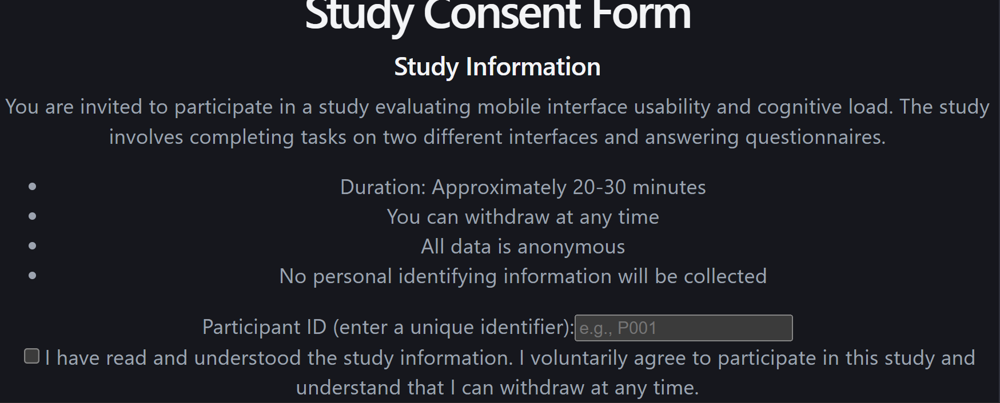
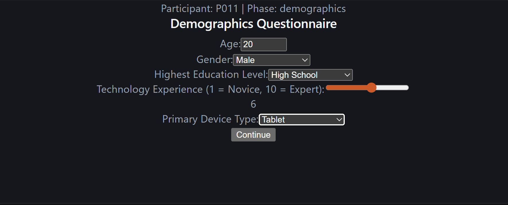
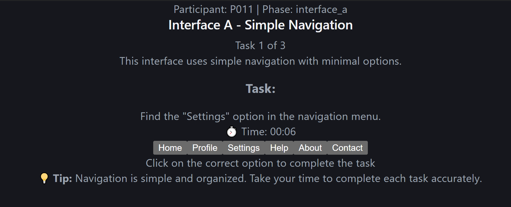
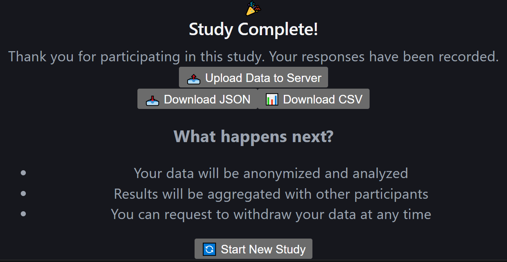

# Study Protocol: Cognitive Load & Usability Evaluation

## Study Overview

This study investigates how interface complexity affects cognitive load and task performance by comparing two distinct interface designs.

### Research Questions

1. Does interface complexity significantly impact task completion time?
2. Does cognitive load differ between simple and complex interfaces?
3. How does perceived usability correlate with interface complexity?
4. Does technology experience influence performance on complex interfaces?

---

## Study Design

- **Type**: Within-subjects design
- **Independent Variable**: Interface complexity (Simple vs Complex)
- **Dependent Variables**: Task completion time, error rate, NASA-TLX scores, SUS scores
- **Participants**: 10 participants (5 female, 5 male)
- **Age Range**: 18-67 years (Mean: 31.1)
- **Education**: High school to PhD
- **Tech Experience**: Mean 6.8/10

---

## Study Procedure

### Phase 1: Consent (2 minutes)

Participants are presented with the study consent form:

- Study purpose and duration (~20-30 minutes)
- Voluntary participation with right to withdraw
- Data anonymity and privacy policy
- Participant ID creation (e.g., P001)



---

### Phase 2: Demographics (3 minutes)

Participants complete a demographics questionnaire:

- Age
- Gender
- Highest Education Level
- Technology Experience (1 = Novice, 10 = Expert)
- Primary Device Type



---

### Phase 3: Interface A - Simple Navigation (5-7 minutes)

Participants complete 3 tasks using a simple interface with:

- Minimal information density
- Progressive disclosure
- Clear visual hierarchy
- Fewer choices

**Task Examples:**

1. Find and select "Settings" in the navigation menu
2. Locate specific information on the page
3. Complete a simple action



**Post-Task Assessment:**
After completing all Interface A tasks, participants complete the NASA-TLX questionnaire.

---

### Phase 4: Interface B - Complex Navigation (5-7 minutes)

Participants complete 3 similar tasks using a complex interface with:

- High information density
- Multiple simultaneous options
- Dense visual hierarchy
- More choices

**Task Examples:**

1. Find specific information among multiple options
2. Navigate through complex menu structures
3. Complete a task with multiple steps

**Post-Task Assessment:**
After completing all Interface B tasks, participants complete the NASA-TLX questionnaire.

---

### Phase 5: SUS Questionnaire (3 minutes)

Participants complete the System Usability Scale (SUS):

- 10 standard questions
- 5-point Likert scale (Strongly Disagree to Strongly Agree)
- Scored 0-100

---

### Phase 6: Data Export & Debriefing (2 minutes)

Participants complete the study and can:

- Upload data to server
- Download JSON
- Download CSV



**Debriefing:**

- Explanation of study purpose
- How data will be used
- Contact information for questions

---

## Measures

### Task Performance Metrics

| Metric              | Description                                |
| ------------------- | ------------------------------------------ |
| **Completion Time** | Time to complete each task (seconds)       |
| **Error Rate**      | Number of errors per task                  |
| **Success Rate**    | Percentage of tasks completed successfully |

### NASA-TLX (6 Dimensions)

| Dimension           | Description                                                   |
| ------------------- | ------------------------------------------------------------- |
| **Mental Demand**   | How much mental and perceptual activity was required?         |
| **Physical Demand** | How much physical activity was required?                      |
| **Temporal Demand** | How much time pressure did you feel?                          |
| **Performance**     | How successful were you in accomplishing the task?            |
| **Effort**          | How hard did you have to work to accomplish your performance? |
| **Frustration**     | How insecure, discouraged, irritated, or annoyed were you?    |

### System Usability Scale (SUS)

10-question questionnaire measuring perceived usability:

1. I would use this system frequently
2. I found the system unnecessarily complex
3. I thought the system was easy to use
4. I think I would need support to use this system
5. I found the various functions well integrated
6. I thought there was too much inconsistency
7. I would imagine most people learn it quickly
8. I found the system very cumbersome to use
9. I felt very confident using the system
10. I needed to learn a lot before I could get going

---

## Data Collection

### Data Storage

- **Frontend**: Zustand state management with local persistence
- **Server**: Node.js + Express storing CSV and JSON files
- **Formats**: JSON (full data) and CSV (aggregated metrics)

### Data Structure

```json
{
  "participantId": "P011",
  "demographics": {
    "age": 20,
    "gender": "Male",
    "education": "High School",
    "techExperience": 6,
    "deviceType": "Tablet"
  },
  "interfaceA": {
    "tasks": [
      {"taskId": 1, "completionTime": 6.0, "errors": 0, "success": true}
    ],
    "nasa_tlx": {
      "mentalDemand": 1.2,
      "physicalDemand": 0.4,
      "temporalDemand": 0.9,
      "performance": 9.1,
      "effort": 0.8,
      "frustration": 0.4
    }
  },
  "interfaceB": {
    "tasks": [...],
    "nasa_tlx": {
      "mentalDemand": 3.6,
      "physicalDemand": 1.3,
      "temporalDemand": 2.6,
      "performance": 7.8,
      "effort": 1.7,
      "frustration": 2.5
    }
  },
  "sus": [4, 3, 5, ...],
  "timestamp": "2024-01-15T10:30:00Z"
}
```
